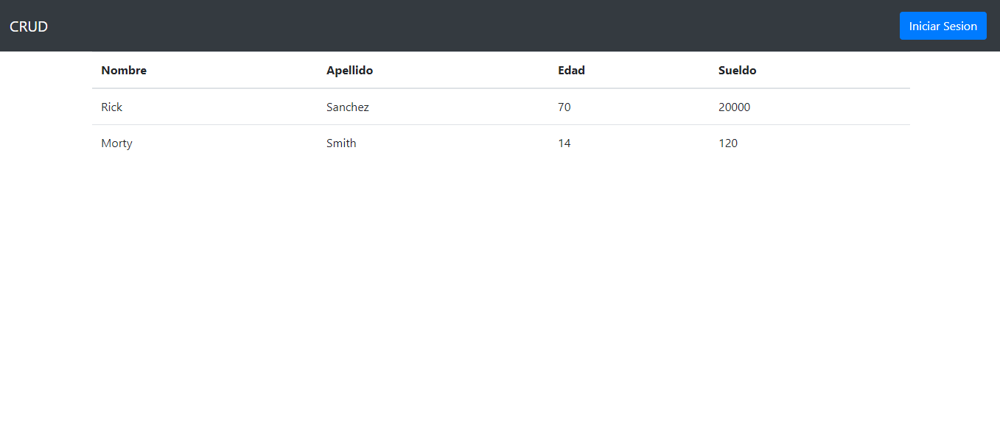
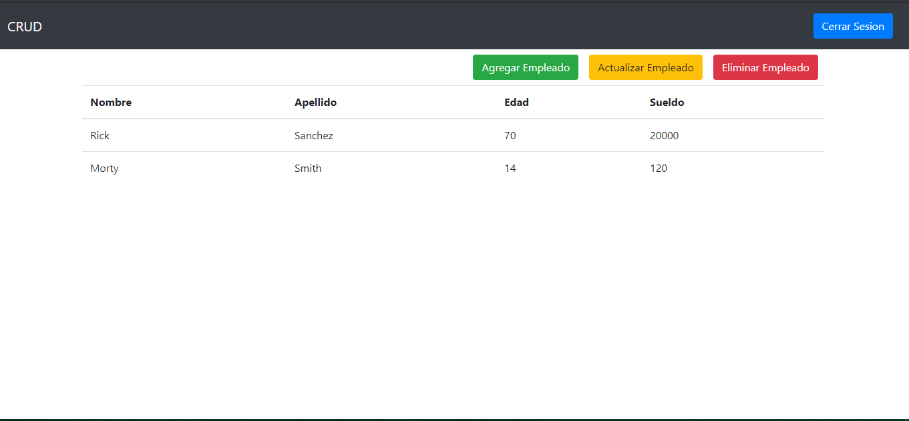
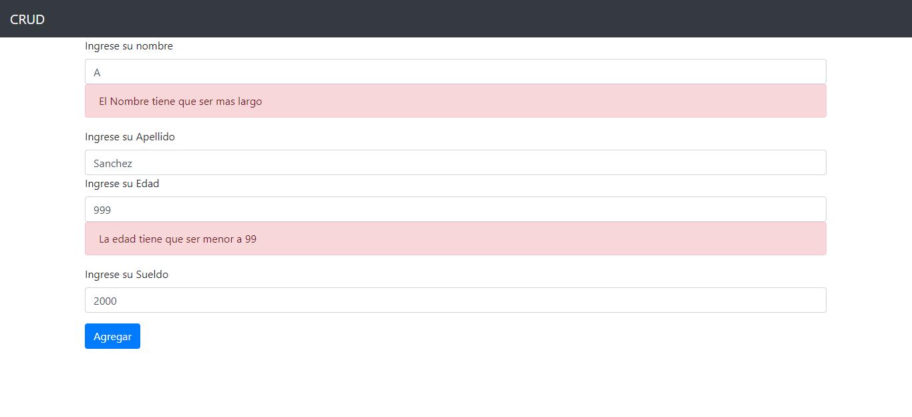

# Crud Spring Boot

## Built with 🛠️

* [Java](https://www.java.com/es/) 
* [Bootstrap](https://getbootstrap.com/)
* [Spring](https://spring.io/)
* [Maven](https://maven.apache.org/)

## Screenshots 📖

